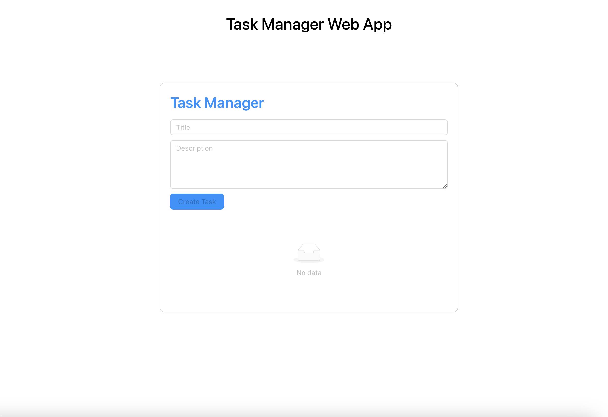

# Task Management System Web Application

This is a web application for a simple task management system. The application allows users to create tasks, mark them as complete, and delete tasks. Both the front-end and back-end components of the application have been implemented using React and Rails.

# 


### [Video Link](https://www.loom.com/share/856b0ec40821421cae3c3f5e3b18b77f?sid=8ff4579b-7861-42a0-9365-7fc1e294b6e2)


## Features

- User-friendly interface for creating tasks, marking them as complete, and deleting tasks.
- Tasks are organized in a list, making it easy for users to manage and track their tasks.
- Responsive design that works well on different devices, including desktop and mobile.
- Persistent data storage, ensuring that tasks are saved even if the application is restarted.

## Technologies Used

The following technologies were used to build this application:

- Front-end:
  - React.js (JavaScript library for building user interfaces)
  - Ant design (React UI library )

- Back-end:
  - Ruby on Rails (web application framework)
  - PostgreSQL (relational database for data storage)

## Installation

To run this application locally, follow these steps:

1. Clone the repository:

   ```bash
   git clone https://github.com/your-username/task-management-system.git

2. Change directory to task-management-system:

   ```bash
   cd task-management-system

3. Install frontend packages and start server(Always run command in the main directory):

   ```bash
   cd front_end && npm install
    npm start

4. Install backend packages and start server(Always run command in the main directory):

   ```bash
   cd back_end && bundle install 
   rails server


👤 **Rich Adu**

- GitHub: 
    - [@assadounto](https://www.github.com/assadounto)
- Twitter:
    - [@adukyerer](https://www.twitter.com/adukyerer)
## 🤝 Contributing

Contributions, issues, and feature requests are welcome!

Feel free to check the [issues page](../../issues/).

## Show your support

Give a ⭐️ if you liked this project!
